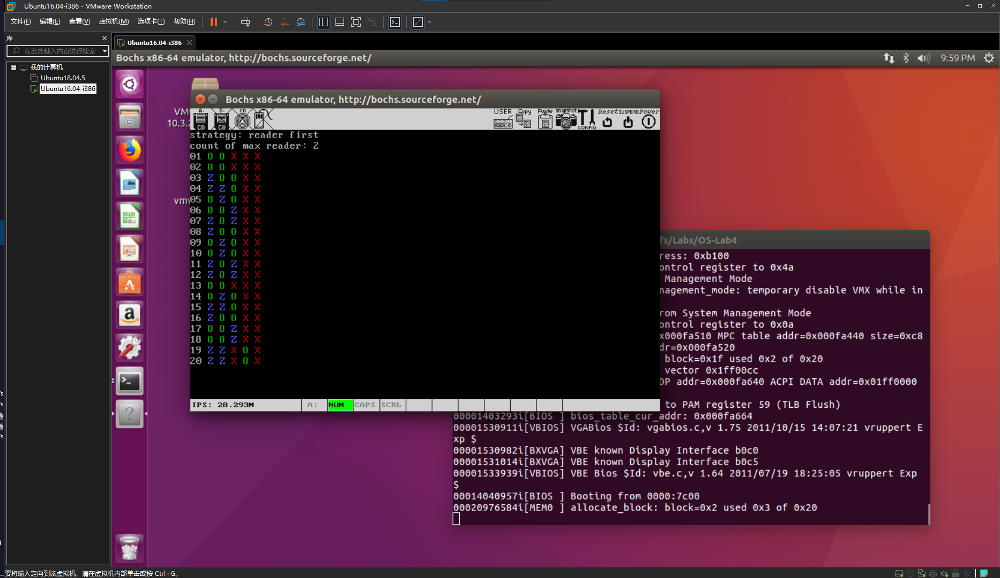
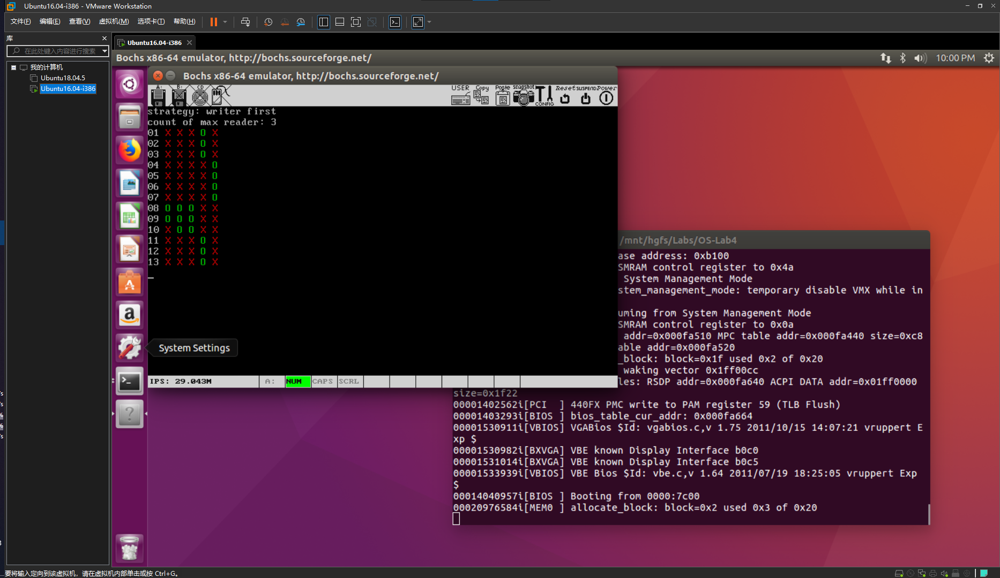

# 《计算机与操作系统》第四次实验
## 实验代码

### 读写公平

```c
void read_fair(int slices) {
	P(&S);
	
	P(&reader_count_mutex);
	P(&reader_mutex);
	if (++readers == 1)
		P(&rw_mutex); // 有读者，禁止写
	V(&reader_mutex);
	
	V(&S);
	
	read_proc(slices);
	
	P(&reader_mutex);
	if (--readers == 0)
		V(&rw_mutex); // 没有读者，可以开始写了
	V(&reader_mutex);
	V(&reader_count_mutex);
}

void write_fair(int slices) {
	P(&S);
	P(&rw_mutex);
	write_proc(slices);
	V(&rw_mutex);
	V(&S);
}
```

### 读者优先

```c

void read_rf(int slices) {
	P(&reader_count_mutex);
	P(&reader_mutex);
	if (++readers == 1)
		P(&writer_mutex); // 有读者时不允许写
	V(&reader_mutex);
	
	read_proc(slices);
	
	P(&reader_mutex);
	if (--readers == 0)
		V(&writer_mutex); // 没有读者时可以开始写
	V(&reader_mutex);
	V(&reader_count_mutex);
}

void write_rf(int slices) {
	P(&writer_mutex);
	write_proc(slices);
	V(&writer_mutex);
}
```

### 写者优先

```c

void read_wf(int slices) {
	P(&rw_mutex);
	P(&reader_mutex);
	if (++readers == 1)
		P(&writer_mutex); // 有读者时不允许写
	V(&reader_mutex);
	V(&rw_mutex);
	
	P(&reader_count_mutex);
	read_proc(slices);
	V(&reader_count_mutex);
	
	P(&reader_mutex);
	if (--readers == 0)
		V(&writer_mutex); // 没有读者时可以开始写
	V(&reader_mutex);
}

void write_wf(int slices) {
	P(&rw_mutex);
	P(&writer_mutex);
	write_proc(slices);
	V(&writer_mutex);
	V(&rw_mutex);
}
```

## 实验截图





## 实验问题

### 进程是什么？

进程是计算机中的程序关于某个数据集合上的一次运行活动，是系统**进行资源分配和调度的基本单位**。从宏观来看，它有自己的目标（功能），同时又能受控于进程调度模块；从微观来看，它可以利用系统的资源，有自己的代码和数据，同时拥有自己的堆栈，进程需要被调度。

### 进程表是什么？

进程表是存储进程状态信息的数据结构。进程表是进程存在的唯一标识，是操作系统用来记录和刻画进程状态及环境信息的数据结构，是进程动态特征的汇集，也是操作系统掌握进程的唯一资料结构和管理进程的主要依据。

### 进程栈是什么？

进程运行时自身的堆栈。

### 当寄存器的值已经被保存到进程表内，`esp` 应该指向何处来避免破坏进程表的值？

进程运行时，`esp` 指向堆栈中的某个位置。寄存器的值刚刚被保存到进程表内，`esp` 是指向进程表某个位置的。如果接下来进行任何的堆栈操作，都会破坏掉进程表的值。为解决这个问题，使用内核栈，让 `esp` 指向内核栈。

### `tty` 是什么？

Teletype 的缩写。终端是一种字符型设备，它有多种类型，通常使用 TTY 来简称各种类型的终端设备。不同 TTY 对应的输入设备是同一个键盘。

### 不同的 `tty` 为什么输出不同的画面在同⼀个显示器上？

不同 TTY 各有一个 CONSOLE，各个 CONSOLE 公用同一块显存。虽然不同的 TTY 对应的输入设备是同一个键盘，但输出却好比是在不同的显示器上，因为不同的 TTY 对应的屏幕画面可能是迥然不同的。实际上，我们当然是在使用同一个显示器，画面的不同只不过是因为显示了显存的不同位置罢了。

### 解释 `tty` 任务执行的过程？

在 TTY 任务中执行一个循环，这个循环将轮询每一个 TTY，处理它的事件，包括从键盘缓冲区读取数据、显示字符等内容。轮询到每一个 TTY 时：

1. 处理输入：查看其是否为当前 TTY。只有当某个 TTY 对应的控制台是当前控制台时，它才可以读取键盘缓冲区；
2. 处理输出：如果有要显示的内容则显示它。

### `tty` 结构体中大概包括哪些内容？

```c
#define TTY_IN_BYTES    256    /* tty input S size */

struct s_console;

/* TTY */
typedef struct {
	u32 in_buf[TTY_IN_BYTES];    /* TTY 输入缓冲区 */
	u32 *p_inbuf_head;        /* 指向缓冲区中下一个空闲位置 */
	u32 *p_inbuf_tail;        /* 指向键盘任务应处理的键值 */
	int inbuf_count;        /* 缓冲区中已经填充了多少 */
	
	struct s_console *p_console;
} TTY;
```

### `console` 结构体中大概包括哪些内容？

```c
/* CONSOLE */
typedef struct s_console {
	unsigned int current_start_addr;    /* 当前显示到了什么位置 */
	unsigned int original_addr;        /* 当前控制台对应显存位置 */
	unsigned int v_mem_limit;        /* 当前控制台占的显存大小 */
	unsigned int cursor;            /* 当前光标位置 */
	u8 color;
} CONSOLE;

#define SCR_UP    1    /* scroll forward */
#define SCR_DN    -1    /* scroll backward */

#define SCREEN_SIZE        (80 * 25)
#define SCREEN_WIDTH        80

#define DEFAULT_CHAR_COLOR    0x07    /* 0000 0111 黑底白字 */
```

### 什么是时间片？

### 结合实验代码解释什么是内核函数？什么是系统调用？
