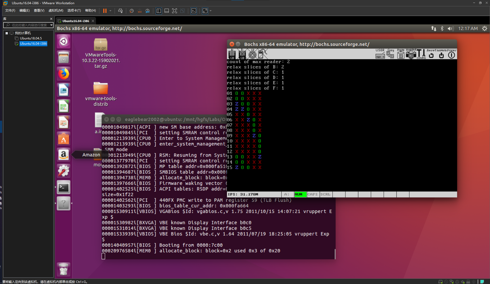

# OS-Lab4
《计算机与操作系统》第四次实验

## 实验代码

## 实验截图

## 实验问题

### 进程是什么？

### 进程表是什么？

### 进程栈是什么？

### 当寄存器的值已经被保存到进程表内，`esp` 应该指向何处来避免破坏进程表的值？

### `tty` 是什么？

### 不同的 `tty` 为什么输出不同的画面在同⼀个显示器上？

### 解释 `tty` 任务执行的过程？

### `tty` 结构体中大概包括哪些内容？

### `console` 结构体中大概包括哪些内容？

### 什么是时间片？

### 结合实验代码解释什么是内核函数？什么是系统调用？
